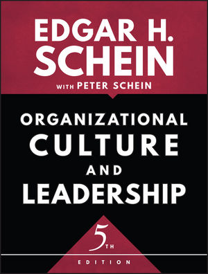
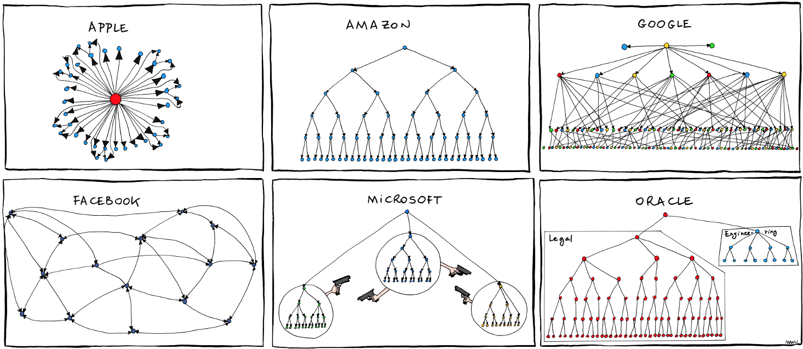

## Operations


<!-- .element: class="plain stretch" -->


----
## Readings

Required reading: Shankar, Shreya, Rolando Garcia, Joseph M. Hellerstein, and Aditya G. Parameswaran. "[Operationalizing machine learning: An interview study](https://arxiv.org/abs/2209.09125)." arXiv preprint arXiv:2209.09125 (2022).

Recommended readings:  
* O'Leary, Katie, and Makoto Uchida. "[Common problems with Creating Machine Learning Pipelines from Existing Code](https://research.google/pubs/pub48984.pdf)." Proc. Conference on Machine Learning and Systems (MLSys) (2020).

----

# Learning Goals


* Deploy a service for models using container infrastructure
* Automate common configuration management tasks
* Devise a monitoring strategy and suggest suitable components for implementing it
* Diagnose common operations problems
* Understand the typical concerns and concepts of MLOps


---
## Running Example: Blogging Platform with Spam Filter


---
# "Operations"

----
## Operations

<!-- colstart -->

Provision and monitor the system in production, respond to problems

Avoid downtime, scale with users, manage operating costs

Heavy focus on infrastructure 

Traditionally sysadmin and hardware skills

<!-- col -->


<!-- colend -->


----
## Service Level Objectives

Quality requirements in operations, such as
* maximum latency
* minimum system throughput
* targeted availability/error rate
* time to deploy an update
* durability for storage

Each with typical measures

For the system as a whole or individual services

----
## Example Service Level Objectives?


----
## Operators on a Team

Operators cannot work in isolation

Rely on developers for software quality and performance

Negotiate service level agreements and budget  (e.g., 99.9% vs 99.99% availability)

Risk management role (not risk avoidance)

----
## Operations and ML

ML has distinct workloads and hardware requirements

Deep learning often pushes scale boundaries

Regular updates or learning in production


----
## Common Themes

Observability is essential

Release management and automated deployments

Infrastructure as code and virtualization

Scaling deployments

Incident response planning


---
# Dev vs. Ops

<!-- .element: style="width:700px" -->

----
## Common Release Problems?

<!-- discussion -->

----
## Common Release Problems?


----
## Common Release Problems (Examples)

* Missing dependencies
* Different compiler versions or library versions
* Different local utilities (e.g. unix grep vs mac grep)
* Database problems
* OS differences
* Too slow in real settings
* Difficult to roll back changes
* Source from many different repositories
* Obscure hardware? Cloud? Enough memory?

----
<!-- colstart -->
## Developers


* Coding
* Testing, static analysis, reviews
* Continuous integration
* Bug tracking
* Running local tests and scalability experiments
* ...

<!-- col -->
## Operations

* Allocating hardware resources
* Managing OS updates
* Monitoring performance
* Monitoring crashes
* Managing load spikes, …
* Tuning database performance
* Running distributed at scale
* Rolling back releases
* ...

<!-- colend -->

QA responsibilities in both roles

----

## Quality Assurance does not stop in Dev

* Ensuring product builds correctly (e.g., reproducible builds)
* Ensuring scalability under real-world loads
* Supporting environment constraints from real systems (hardware, software, OS)
* Efficiency with given infrastructure
* Monitoring (server, database, Dr. Watson, etc)
* Bottlenecks, crash-prone components, … (possibly thousands of crash reports per day/minute)


---
# DevOps
<!-- .element: class="plain" style="width:900px" -->

----
## Key ideas and principles

* Better coordinate between developers and operations (collaborative)
* Key goal: Reduce friction bringing changes from development into production
* Considering the *entire tool chain* into production (holistic)
* Documentation and versioning of all dependencies and configurations ("configuration as code")
* Heavy automation, e.g., continuous delivery, monitoring
* Small iterations, incremental and continuous releases
* 
* Buzz word!
----
<!-- .element: class="plain" style="width:1100px" -->


----
## Common Practices

All configurations in version control

Test and deploy in containers

Automated testing, testing, testing, ...

Monitoring, orchestration, and automated actions in practice

Microservice architectures

Release frequently

----
## Heavy tooling and automation

[](devops_tools.jpg)

----
## Heavy tooling and automation -- Examples

* Infrastructure as code — Ansible, Terraform, Puppet, Chef
* CI/CD — Jenkins, TeamCity, GitLab, Shippable, Bamboo, Azure DevOps
* Test automation — Selenium, Cucumber, Apache JMeter
* Containerization — Docker, Rocket, Unik
* Orchestration — Kubernetes, Swarm, Mesos
* Software deployment — Elastic Beanstalk, Octopus, Vamp
* Measurement — Datadog, DynaTrace, Kibana, NewRelic, ServiceNow


---
# Continuous Delivery

----
## Manual Release Pipelines


<!-- .element: class="stretch" -->

<!-- references_ -->
Source: https://www.slideshare.net/jmcgarr/continuous-delivery-at-netflix-and-beyond

----
<!-- colstart -->
## Continuous Integr.

* Automate tests after commit
* Independent test infrastructure

## Continuous Delivery

* Full automation from commit to deployable container
* Heavy focus on testing, reproducibility and rapid feedback, creates transparency

<!-- col -->
## Continuous Deployment

* Full automation from commit to deployment
* Empower developers, quick to production
* Encourage experimentation and fast incremental changes
* Commonly integrated with monitoring and canary releases

<!-- colend -->
----
## Automate Everything

<!-- .element: style="width:1200px" -->
----
## Example: Facebook Tests for Mobile Apps

* Unit tests (white box)
* Static analysis (null pointer warnings, memory leaks, ...)
* Build tests (compilation succeeds)
* Snapshot tests (screenshot comparison, pixel by pixel)
* Integration tests (black box, in simulators)
* Performance tests (resource usage)
* Capacity and conformance tests (custom)

<!-- references -->
Further readings: Rossi, Chuck, Elisa Shibley, Shi Su, Kent Beck, Tony Savor, and Michael Stumm. [Continuous deployment of mobile software at facebook (showcase)](https://research.fb.com/wp-content/uploads/2017/02/fse-rossi.pdf). In Proceedings of the 2016 24th ACM SIGSOFT International Symposium on Foundations of Software Engineering, pp. 12-23. ACM, 2016.

----
## Release Challenges for Mobile Apps

* Large downloads
* Download time at user discretion 
* Different versions in production
* Pull support for old releases?
*
* Server side releases silent and quick, consistent
* 
* -> App as container, most content + layout from server

----
## Real-world pipelines are complex

[](facebookpipeline.png)
<!-- .element: class="stretch" -->


---

# Containers and Configuration Management
----
## Containers

<!-- colstart -->
* Lightweight virtual machine
* Contains entire runnable software, incl. all dependencies and configurations
* Used in development and production
* Sub-second launch time
* Explicit control over shared disks and network connections

<!-- col -->


<!-- colend -->
----
## Docker Example

```docker
FROM ubuntu:latest
MAINTAINER ...
RUN apt-get update -y
RUN apt-get install -y python-pip python-dev build-essential
COPY . /app
WORKDIR /app
RUN pip install -r requirements.txt
ENTRYPOINT ["python"]
CMD ["app.py"]
```

<!-- references -->
Source: http://containertutorials.com/docker-compose/flask-simple-app.html

----
## Common configuration management questions

What runs where?

How are machines connected?

What (environment) parameters does software X require?

How to update dependency X everywhere?

How to scale service X?

----
## Ansible Examples

* Software provisioning, configuration mgmt., and deployment tool
* Apply scripts to many servers

<!-- colstart -->
```ini
[webservers]
web1.company.org
web2.company.org
web3.company.org

[dbservers]
db1.company.org
db2.company.org

[replication_servers]
...
```
<!-- col -->
```yml
# This role deploys the mongod processes and sets up the replication set.
- name: create data directory for mongodb
  file: path={{ mongodb_datadir_prefix }}/mongo-{{ inventory_hostname }} state=directory owner=mongod group=mongod
  delegate_to: '{{ item }}'
  with_items: groups.replication_servers

- name: create log directory for mongodb
  file: path=/var/log/mongo state=directory owner=mongod group=mongod

- name: Create the mongodb startup file
  template: src=mongod.j2 dest=/etc/init.d/mongod-{{ inventory_hostname }} mode=0655
  delegate_to: '{{ item }}'
  with_items: groups.replication_servers


- name: Create the mongodb configuration file
  template: src=mongod.conf.j2 dest=/etc/mongod-{{ inventory_hostname }}.conf
  delegate_to: '{{ item }}'
  with_items: groups.replication_servers

- name: Copy the keyfile for authentication
  copy: src=secret dest={{ mongodb_datadir_prefix }}/secret owner=mongod group=mongod mode=0400

- name: Start the mongodb service
  command: creates=/var/lock/subsys/mongod-{{ inventory_hostname }} /etc/init.d/mongod-{{ inventory_hostname }} start
  delegate_to: '{{ item }}'
  with_items: groups.replication_servers

- name: Create the file to initialize the mongod replica set
  template: src=repset_init.j2 dest=/tmp/repset_init.js

- name: Pause for a while
  pause: seconds=20

- name: Initialize the replication set
  shell: /usr/bin/mongo --port "{{ mongod_port }}" /tmp/repset_init.js
```
<!-- colend -->

----
## Puppet Example

Declarative specification, can be applied to many machines

```puppet
$doc_root = "/var/www/example"

exec { 'apt-get update':
 command => '/usr/bin/apt-get update'
}

package { 'apache2':
 ensure  => "installed",
 require => Exec['apt-get update']
}

file { $doc_root:
 ensure => "directory",
 owner => "www-data",
 group => "www-data",
 mode => 644
}

file { "$doc_root/index.html":
   ensure => "present",
   source => "puppet:///modules/main/index.html",
   require => File[$doc_root]
}

file { "/etc/apache2/sites-available/000-default.conf":
   ensure => "present",
   content => template("main/vhost.erb"),
   notify => Service['apache2'],
   require => Package['apache2']
}

service { 'apache2':
   ensure => running,
   enable => true
}
```

Note: source: https://www.digitalocean.com/community/tutorials/configuration-management-101-writing-puppet-manifests

----
## Container Orchestration with Kubernetes

Manages which container to deploy to which machine

Launches and kills containers depending on load

Manage updates and routing

Automated restart, replacement, replication, scaling

Kubernetis master controls many nodes

*Substantial complexity and learning curve*

----


<!-- .element: class="stretch" -->

<!-- references_ -->
CC BY-SA 4.0 [Khtan66](https://en.wikipedia.org/wiki/Kubernetes#/media/File:Kubernetes.png)
----
## Monitoring

* Monitor server health
* Monitor service health
* Monitor telemetry (see past lecture)
* Collect and analyze measures or log files
* Dashboards and triggering automated decisions
* 
* Many tools, e.g., Grafana as dashboard, Prometheus for metrics, Loki + ElasticSearch for logs
* Push and pull models

----


<!-- source -->
https://www.hawkular.org/hawkular-apm/
 


---
## The DevOps Mindset

* Consider the entire process and tool chain holistically
* Automation, automation, automation
* Elastic infrastructure
* Document, test, and version everything
* Iterate and release frequently
* Emphasize observability
* Shared goals and responsibilities


---

<!-- .element: class="stretch" -->

<!-- references_ -->
https://ml-ops.org/

----
## On Terminology

* Many vague buzzwords, often not clearly defined
* **MLOps:** Collaboration and communication between data scientists and operators, e.g.,
  - Automate model deployment
  - Model training and versioning infrastructure
  - Model deployment and monitoring
* **AIOps:** Using AI/ML to make operations decision, e.g. in a data center
* **DataOps:** Data analytics, often business setting and reporting
  - Infrastructure to collect data (ETL) and support reporting
  - Combines agile, DevOps, Lean Manufacturing ideas


<!-- .element: class="cornerimg" -->

----
## MLOps Overview

Integrate ML artifacts into software release process, unify process (i.e., DevOps extension)

Automated data and model validation (continuous deployment)


Continuous deployment for ML models: from experimenting in notebooks to quick feedback in production

Versioning of models and datasets (more later)

Monitoring in production (discussed earlier)


<!-- references -->
Further reading: [MLOps principles
](https://ml-ops.org/content/mlops-principles.html)

----
## Tooling Landscape LF AI

[](https://landscape.lfai.foundation/)

<!-- references -->
Linux Foundation AI Initiative


----
## MLOps Goals and Principles

Like DevOps: Automation, testing, holistic, observability, teamwork

Supporting frequent experimentation, rapid prototyping, and constant iteration

3V: Velocity, Validation, Versioning


----
## MLOps Tools -- Examples

* Model registry, versioning and metadata: MLFlow, Neptune, ModelDB, WandB, ...
* Model monitoring: Fiddler, Hydrosphere
* Data pipeline automation and workflows: DVC, Kubeflow, Airflow
* Model packaging and deployment: BentoML, Cortex
* Distributed learning and deployment: Dask, Ray, ...
* Feature store: Feast, Tecton
* Integrated platforms: Sagemaker, Valohai, ...
* Data validation: Cerberus, Great Expectations, ...

Long list: https://github.com/kelvins/awesome-mlops


----
## MLOps Common Goals

Enable experimentation with data and models, small incremental changes; hide complexity from data scientists

Automate (nuanced) model validation (like CI) and integrate with testing in production (monitoring)

Dynamic view of constantly evolving training and test data; invest in data validation

Version data, models; track experiment results


----
## Recall: DevOps Mindset

* Consider the entire process and tool chain holistically
* Automation, automation, automation
* Elastic infrastructure
* Document, test, and version everything
* Iterate and release frequently
* Emphasize observability
* Shared goals and responsibilities


----
## Breakout: MLOps Goals

For the blog spam filter scenario, consider DevOps and MLOps infrastructure (CI, CD, containers, config. mgmt, monitoring, model registry, pipeline automation, feature store, data validation, ...)

As a group, tagging group members, post to `#lecture`:
> * Which DevOps or MLOps goals to prioritize? 
> * Which tools to try?


---
# Incident Response Planning

----
## Mistakes will Happen. Be Prepared

Even with careful anticipation and mitigation, mistakes will happen

Anticipated or not

ML as unreliable component raises risks


Design mitigations help avoid anticipated mistakes

Incident response plan prepares for unanticipated or unmitigated mistakes

----
## Incident Response Plan

* Provide contact channel for problem reports
* Have expert on call
* Design process for anticipated problems, e.g., rollback, reboot, takedown
* Prepare for recovery
* Proactively collect telemetry
* Investigate incidents
* Plan public communication (responsibilities)

----
## Incident Resp. Plan for Blog's Spam Filter?


---
# Excursion: Organizational Culture




----
## Organizational Culture

*“this is how we always did things”*

Implicit and explicit assumptions and rules guiding behavior

Often grounded in history, very difficult to change

Examples:
* Move fast and break things
* Privacy first
* Development opportunities for all employees


----

<!-- .element: class="plain stretch" -->

<!-- references_ -->
Source: Bonkers World


----
## Organizational Culture


----
## Levels of Organizational Culture


Artifacts -- What we see
* Behaviors, systems, processes, policies

Espoused Values -- What we say
* Ideals, goals, values, aspirations

Basic assumptions -- What we believe
* Underlying assumptions, "old ways of doing things", unconsciously taken for granted


Iceberg models: Only artifacts and espoused values visible, but practices driven by invisible basic assumptions


----
## Culture Change

Changing organizational culture is very difficult

Top down: espoused values, management buy in, incentives

Bottom up: activism, show value, spread


**Examples of success of failure stories?**

----
## MLOps Culture

Dev with Ops instead of Dev vs Ops

A culture of collaboration, joint goals, joint responsibilities

Artifacts: Joint tools, processes

Underlying assumptions: Devs provide production-ready code; Ops focus on value, automation is good, observability is important, ...

----
## Resistance to DevOps Culture?

From "us vs them" to blameless culture -- How?

Introduction of new tools and processes -- Disruptive? Costly? Competing with current tasks? Who wants to write tests?

Future benefits from rapid feedback and telemetry -- Unrealistic?

Automation and shifting responsibilities  -- Hiring freeze and layoffs?

Past experience with poor adoption -- All costs, no benefits? Compliance only?


----
## Successful DevOps Adoption

Need supportive management; typically driven by advocacy of individuals, convincing colleagues and management

Education to generate buy-in

Experts and consultants can help with initial costly transition

Demonstrate benefits on small project, promote afterward

Focus on key bottlenecks, over perfect adoption (e.g., prioritize experimentation, test automation, rapid feedback with telemetry)

<!-- references -->
Luz, Welder Pinheiro, Gustavo Pinto, and Rodrigo Bonifácio. “[Adopting DevOps in the real world: A theory, a model, and a case study](http://gustavopinto.org/lost+found/jss2019.pdf).” Journal of Systems and Software 157 (2019): 110384.


---
# Summary

* Plan for change, plan for operations
* Operations requirements: service level objectives
* DevOps integrations development and operations tasks with joint goals and tools
  * Heavy automation
  * Continuous integration and continuous delivery
  * Containers and configuration management
  * Monitoring
* MLOps extends this to operating pipelines and deploying models
* Organizational culture is slow and difficult to change

----
## Further Reading

<div class="small">

* Shankar, Shreya, Rolando Garcia, Joseph M. Hellerstein, and Aditya G. Parameswaran. "[Operationalizing machine learning: An interview study](https://arxiv.org/abs/2209.09125)." arXiv preprint arXiv:2209.09125 (2022).
* https://ml-ops.org/ 
* Beyer, Betsy, Chris Jones, Jennifer Petoff, and Niall Richard Murphy. [Site reliability engineering: How Google runs production systems](https://sre.google/sre-book/table-of-contents/). O’Reilly, 2016.
* Kim, Gene, Jez Humble, Patrick Debois, John Willis, and Nicole Forsgren. [The DevOps Handbook: How to Create World-Class Agility, Reliability, & Security in Technology Organizations](https://bookshop.org/books/the-devops-handbook-how-to-create-world-class-agility-reliability-security-in-technology-organizations/9781950508402). IT Revolution, 2nd ed, 2021.
* Treveil, Mark, Nicolas Omont, Clément Stenac, Kenji Lefevre, Du Phan, Joachim Zentici, Adrien Lavoillotte, Makoto Miyazaki, and Lynn Heidmann. [Introducing MLOps: How to Scale Machine Learning in the Enterprise](https://bookshop.org/books/introducing-mlops-how-to-scale-machine-learning-in-the-enterprise/9781492083290). O’Reilly, 2020.
* Luz, Welder Pinheiro, Gustavo Pinto, and Rodrigo Bonifácio. “[Adopting DevOps in the real world: A theory, a model, and a case study](http://gustavopinto.org/lost+found/jss2019.pdf).” Journal of Systems and Software 157 (2019): 110384.
* Schein, Edgar H. *Organizational culture and leadership*. 5th ed. John Wiley & Sons, 2016.
</div>